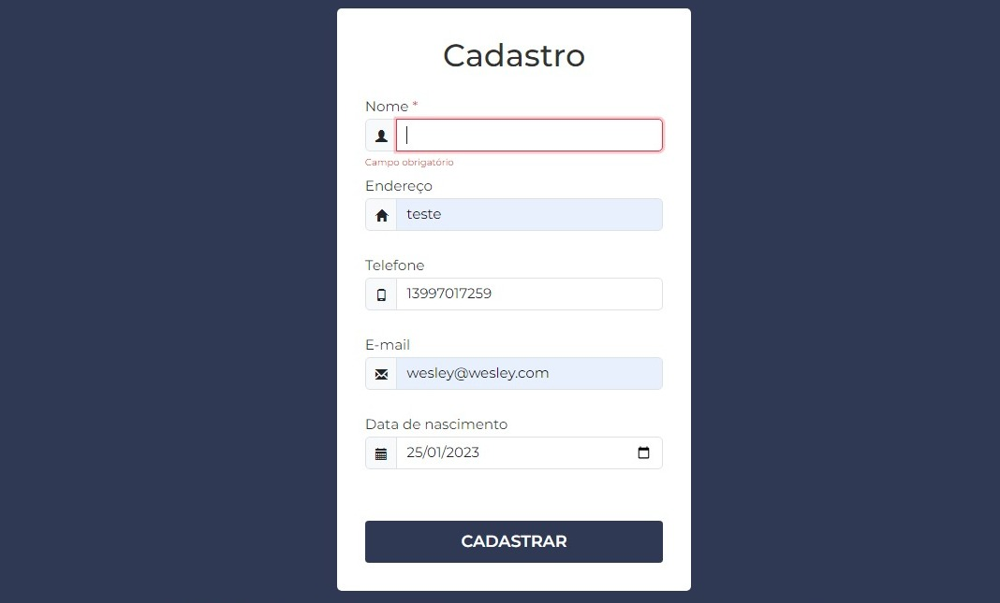

# Teste Insight IT- Formulário com validação 

  
  
  

 

Formulário de cadastro desenvolvido seguindo os requisitos do enunciado do teste para a vaga de Desenvolvedor Front End na Insight IT.

  

## Como iniciar o projeto

  
Iniciando o projeto

  <ul>
    <li>Clone este repositório na sua máquina.</li>
    <li>Após isso, entre na pasta do projeto pelo CMD e digite o comando <code>npm install</code> para instalar as dependências</li>
    <li>Assim que instalar as dependências, digite no CMD o comando <code>npm start</code>, que iniciará a aplicação no seu navegador.</li>
  </ul>

## Linguagens, Frameworks e Bibliotecas

- [x] ReactJS
- [x] Javascript
- [x] Bootstrap
- [x] Yup
- [x] React Hook Form
- [x] React Router Dom
- [x] React Toastify

## Desenvolvimento

<table>
  <tr>
    <td border="1px solid #ddd" align="center">
      <a href="https://github.com/wesleysantossts">
        
         
        Wesley Santos
      </a>
    </td>
  </tr>
</table>